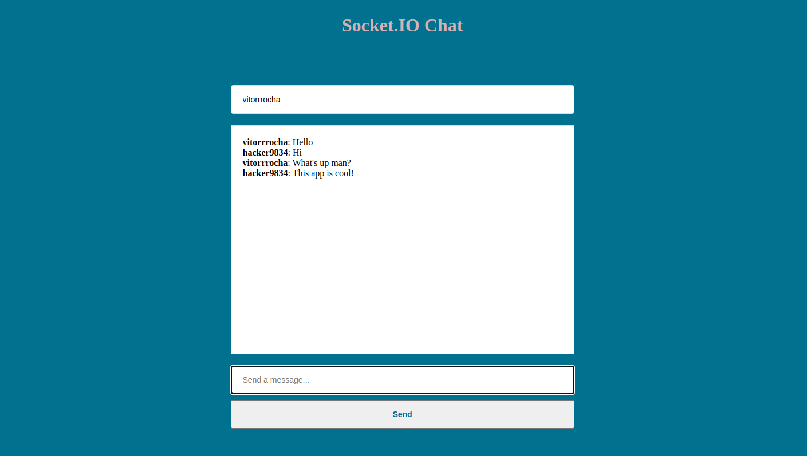

# Chat-app

<p align="center">

  <a href="LICENSE" style="text-decoration: none">
    
  </a>

  <a href="https://github.com/Vitorrrocha/Socket.IO-Chat/issues" style="text-decoration: none">
    
  </a>

  <a href="#" style="text-decoration: none">
    
  </a>
  
  <a href="https://github.com/Vitorrrocha/Socket.IO-Chat/stargazers" style="text-decoration: none">
    
  </a>

</p>

## :rocket: Technologies

This project was developed with the following technologies:

- Back-End
  - [Node.js](https://nodejs.org/en/)
  - Express.js
  - Socket.io
- Front-End
  - Ejs

## 💻 Project

A chat app created using ejs, node with express and socket.io.

### Available Scripts 💻

**Cloning repository and running**

```bash
$ git clone https://github.com/Vitorrrocha/Socket.IO-Chat && cd Socket.IO-Chat
```

**Installing dependencies**

```bash
$ yarn
```

**Getting Started**

```bash
$ node server.js
```

## :memo: License

MIT license. See the file [LICENSE](LICENSE) for more details.

## 🙏🏼 Acknowledgments

I want to thank [Rocketseat](https://github.com/Rocketseat) for providing these technologies and knowledges.


---
